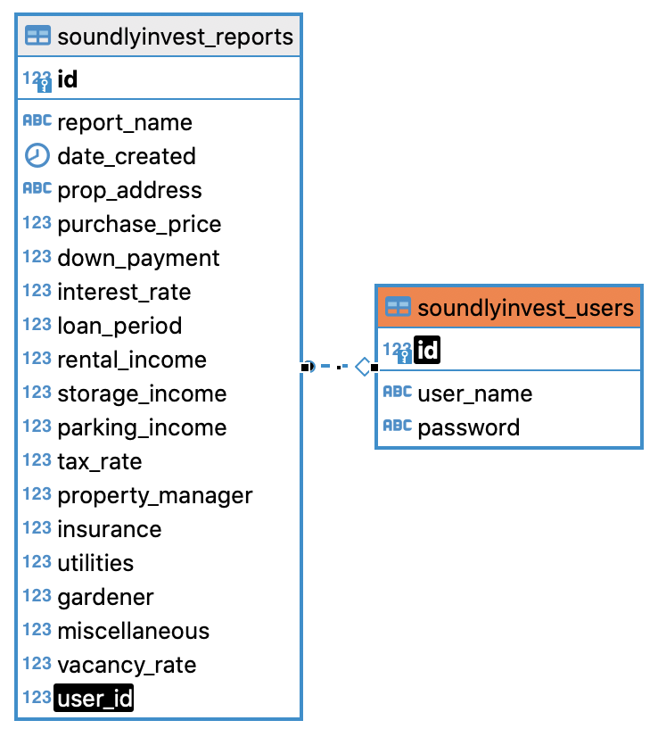

# SoundlyInvest API

This is a project using a PostgreSQL database and Express server for the SoundlyInvest app. In three steps, you get a detailed investment report displaying key investment metrics, such as gross rent multiplier, cap rate, net operating income, and cash flow.

## SoundlyInvest Client

View the client side code in this [GitHub repo](https://github.com/gavinmgrant/soundlyinvest-client).

## Technology

* [Node.js](https://nodejs.org/en/) - JavaScript runtime environment
* [Express](https://expressjs.com/) - Node.js framework
* [RESTful APIs](https://restfulapi.net/) - Architectural style for an API
* [PostgreSQL](https://www.postgresql.org/) - Relational Database 
* [Knex.js](http://knexjs.org/) - SQL query builder
* [JWT](https://jwt.io/) - Authentication 
* [Supertest](https://www.npmjs.com/package/supertest) - Testing HTTP calls 
* [Mocha](https://mochajs.org/) - Testing framework
* [Chai](https://www.chaijs.com/) - Assertion library
* [Heroku](https://heroku.com) - Cloud platform for deployment
* [react-places-autocomplete](https://www.npmjs.com/package/react-places-autocomplete) - Google Maps Places Autocomplete API

## Setup

* Clone this repository to your local computer.
* Install the dependencies for the project. `npm install`
* Confirm your PostgreSQL server is running.
* If you want to seed your database, you can use this seed script: 

```
psql -U YOUR_USERNAME -d YOUR_DATABASE_NAME -f ./seeds/seed.soundlyinvest_tables.sql
```

* Copy the `example.env` file as `.env` and update `.env` with the following fields with your database credentials:

```
DATABASE_URL="postgresql://YOUR_USERNAME@localhost/YOUR_DATABASE_NAME"
TEST_DATABASE_URL="postgresql://YOUR_USERNAME@localhost/YOUR_TEST_DATABASE_NAME"
```

* You can now run the server locally with `npm start`.

## Schema

### Entity Relationship Diagram


### Reports Table `soundlyinvest_reports`
```
{
    id: Integer (primary key),
    report_name: String,
    date_created: Timestamp,
    prop_address: String,
    purchase_price: Integer,
    down_payment: Integer,
    interest_rate: Float,
    loan_period: Integer,
    rental_income: Integer,
    storage_income: Integer,
    parking_income: Integer,
    tax_rate: Float,
    property_manager: Integer,
    insurance: Integer,
    utilities: Integer,
    gardener: Integer,
    miscellaneous: Integer,
    vacancy_rate: Integer,
    user_id: Integer (foreign key)
}
```

### Users Table `soundlyinvest_users`
```
{
    id: Integer (primary key),
    user_name: String,
    password: String
}
```

## API Overview
```
/api
├── /auth
│   └── POST
│       ├── /login
│       ├── /refresh
├── /users
│   └── POST
│       └── / 
└── /reports
    ├── GET
    │   ├── /
    │   └── /:id
    ├── POST 
    │   └── /
    ├── DELETE 
    │    └── /:id  
    └── PATCH
         └── /:id 
```

### POST `/api/auth/login`
```
// req.body
{
    user_name: String,
    password: String
}

// res.body
{
    authToken: String,
    user_id: Integer,
    user_name: String
}
```

### POST `/api/auth/refresh`
```
// req.header
authorization: bearer ${token}

// res.body
{
    authToken: ${token}
}
```

### POST `/api/users`
```
// req.body
{
    user_name: String,
    password: String
}

// res.body
{
    id: Integer,
    user_name: String
}
```

### GET `/api/reports`
```
// req.header
authorization: bearer ${token}

// req.body
{
    user_id: Integer
}

// res.body
{
    id: Integer,
    report_name: String,
    date_created: Timestamp,
    prop_address: String,
    purchase_price: Interger,
    down_payment: Interger,
    interest_rate: Float,
    loan_period: Interger,
    rental_income: Interger,
    storage_income: Interger,
    parking_income: Interger,
    tax_rate: Float,
    property_manager: Interger,
    insurance: Interger,
    utilities: Interger,
    gardener: Interger,
    miscellaneous: Interger,
    vacancy_rate: Interger,
    user_id: Integrer,
}
```

### GET `/api/reports/:id`
```
// req.header
authorization: bearer ${token}

// req.params
{
    id: Integer
}

// res.body
{
    id: Integer,
    report_name: String,
    date_created: Timestamp,
    prop_address: String,
    purchase_price: Interger,
    down_payment: Interger,
    interest_rate: Float,
    loan_period: Interger,
    rental_income: Interger,
    storage_income: Interger,
    parking_income: Interger,
    tax_rate: Float,
    property_manager: Interger,
    insurance: Interger,
    utilities: Interger,
    gardener: Interger,
    miscellaneous: Interger,
    vacancy_rate: Interger,
    user_id: Integrer,
}
```

### POST `/api/reports`
```
// req.header
authorization: bearer ${token}

// req.body
{
    report_name: String,
    date_created: Timestamp,
    prop_address: String,
    purchase_price: Interger,
    down_payment: Interger,
    interest_rate: Float,
    loan_period: Interger,
    rental_income: Interger,
    storage_income: Interger,
    parking_income: Interger,
    tax_rate: Float,
    property_manager: Interger,
    insurance: Interger,
    utilities: Interger,
    gardener: Interger,
    miscellaneous: Interger,
    vacancy_rate: Interger,
    user_id: Integrer,
}

// res.body
{
    id: Integer,
    report_name: String,
    date_created: Timestamp,
    prop_address: String,
    purchase_price: Interger,
    down_payment: Interger,
    interest_rate: Float,
    loan_period: Interger,
    rental_income: Interger,
    storage_income: Interger,
    parking_income: Interger,
    tax_rate: Float,
    property_manager: Interger,
    insurance: Interger,
    utilities: Interger,
    gardener: Interger,
    miscellaneous: Interger,
    vacancy_rate: Interger,
    user_id: Integrer,
}
```

### DELETE `/api/reports/:id`
```
// req.header
authorization: bearer ${token}

// req.params
{
    id: Integer
}

// req.body
{
    user_id: Integer
}
```

### PATCH `/api/reports/:id`
```
// req.header
authorization: bearer ${token}

// req.params
{
    id: Integer
}

// req.body
{
    report_name: String,
    date_created: Timestamp,
    prop_address: String,
    purchase_price: Interger,
    down_payment: Interger,
    interest_rate: Float,
    loan_period: Interger,
    rental_income: Interger,
    storage_income: Interger,
    parking_income: Interger,
    tax_rate: Float,
    property_manager: Interger,
    insurance: Interger,
    utilities: Interger,
    gardener: Interger,
    miscellaneous: Interger,
    vacancy_rate: Interger,
    user_id: Integrer,
}

// res.body
{
    id: Integer,
    report_name: String,
    date_created: Timestamp,
    prop_address: String,
    purchase_price: Interger,
    down_payment: Interger,
    interest_rate: Float,
    loan_period: Interger,
    rental_income: Interger,
    storage_income: Interger,
    parking_income: Interger,
    tax_rate: Float,
    property_manager: Interger,
    insurance: Interger,
    utilities: Interger,
    gardener: Interger,
    miscellaneous: Interger,
    vacancy_rate: Interger,
    user_id: Integrer,
}
```